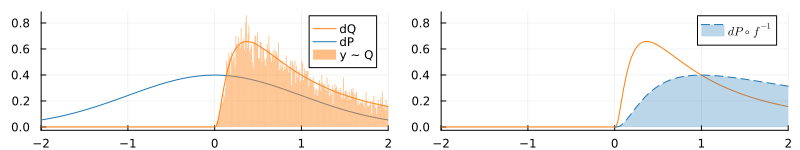
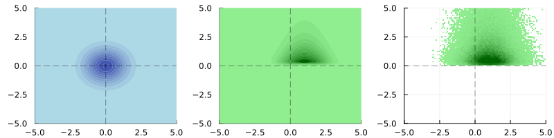

# The push-forward of a distribution

We define a "push forward" type for Gen distributions.

**Push-forward.** (DRAFT- might lack some technical details, choosing measures and so on ...)
Let $f:X \to Y$ be an invertible function and $P$ be a probability distribution on $X$.
Then the push-forward $f_*P$ of $P$ under $f$ is defined as 

$$
    f_*P := P \circ f^{-1}.
$$

Here $f^{-1}$ denotes the preimage. A sample $x \sim P$ defines a sample $y = f(x) \sim (f_*P)$.

Let $Q = f_*P$ be the push-forward of a probability distribution then its density $q$ is given by

$$
    q(y) = \frac{dQ}{dy}(y)  =  \ldots =p(x) \cdot \frac{1}{|\det df_x|}.
$$

**Proof sketch.** Let's just get some intuition why the above holds &mdash; I am aware that this is not a solid proof. Let $B \subset Y$ be a "small" subset containing a previously chosen $y$. Obviously $A = f^{-1}(B) \subset X$ is a subset containing $x = f^{-1}(y)$. Now we can write

$$
	q(y) \approx \frac{Q(B)}{|B|} = \frac{P(A)}{|f(A)|} = \frac{P(A)}{|A|}\cdot \frac{|A|}{|f(A)|} \approx p(x) \cdot \frac{1}{|\det df_x|}.
$$

Now make sense of all symbols that are not defined, and add some appropriate limits. &#9724;



**Figure 1.** Visualization of Example 1 below &mdash; Pushing forward a normal distribution by the exponential function. *Left:* Comparing the analytically computed density of the push-forward with the approximate empirical density from a number of samples. *Right:* Comparing the density of the push-forward with the wrong density that is missing the correction term.



**Figure 2.** Pushing forward a multivariate Gaussian by $f:(x,y) \mapsto (x+1,exp(y))$. Densities of the gaussian (left), its push forward by $f$ (middle) , and its sample density (right).

# Example 1 (continuous example)

Let's consider the pushforward of

$$
    p(x) = N(x ; \mu=0,\sigma=1)
$$

under 

$$
    f(x) = \exp(x).
$$

Note that $f$ is not one-to-one but invertible over its image. We can 
still use our pushforward object by incorporating `OutOfDomain()` values (or `out_of_domain`) in the inverse of $f$.


```julia
using GenPushForward
using Gen

# The distribution we want to push forward...
P = normal
args = (0.0, 1.)

# ...and the function to push forward with.
# Note that `f` is only invertible over its image.
f     =  x -> exp(x)
detdf =  x -> exp(x)
g     =  y -> y > 0 ? log(y) : out_of_domain;

# The push-forward
Q = PushForward(P, f, g, detdf, Float64)

# Reality check if `f` and `g` are indeed inverse, and 
# if `det(df)` is correct.
check(Q,args) 

# We can now sample from `Q`,
# evaluate its log-density 
samples = [Q(args...) for t=1:1000]
w = logpdf(Q, 1.0, args...)

# ...and use it just like any other Gen distribution.
@gen function gen_func()
    y ~ Q(args...)
end
```

# Example 2 (discrete example)

Let's consider the pushforward of 

$$
    p(x) = \text{bernoulli}(0.75)
$$

under 

$$
     1 \mapsto x, 0 \mapsto y
$$


Since we are dealing with discrete spaces our function will take the form of a dictionary

```julia
f = Dict(true => :x, false => "y");
```

We can then can use some syntactic sugar to define the push forward &mdash; return type and inverse mapping are constructed automatically for you.

```julia
P = bernoulli;
Q = f*P; # Syntactic sugar for `PushForward(P, f)`

# We can now sample from `Q`,
# evaluate its log-density 
args = (0.75,)
samples = [Q(args...) for t=1:1000]
w = logpdf(Q, :x, args...)

# ...and use it just like any other Gen distribution.
@gen function gen_func()
    y ~ Q(args...)
end
```

**Remark:** 
Note that for this example we could have used the `@dist` [DSL](https://www.gen.dev/docs/stable/ref/distributions/#dist_dsl-1). However it seems like the push-forward implementation is slightly faster &mdash; at least for the this trivial example.

```julia
@dist function Q_DSL(p, f)
    x = bernoulli(p)
    f[x]
end
```

Let's compare the avg. runtimes for sampling and evaluation of the log-pdfs.

**Benchmarks:** 
We compare avg. sampling time from `P`, `Q`, and `Q_DSL` and avg. evaluation time from the respective log-pdfs `p`, `q`, and `q_DSL` (as defined in the code snippet above).

```julia
using BenchmarkTools

# The logpdfs of the above distributions
p     = x -> logpdf(P, true, args...)
q     = x -> logpdf(Q, :x, args...)
q_DSL = x -> logpdf(Q_DSL, :x, args..., f)

@btime $P($args...);
@btime $Q($args...);
@btime $Q_DSL($args..., f);

# >> 4.716 ns (0 allocations: 0 bytes)
# >> 34.898 ns (1 allocation: 16 bytes)
# >> 571.685 ns (17 allocations: 544 bytes)
 
@btime $p(true);
@btime $q(:x);
@btime $q_DSL(:x);

# >> 147.667 ns (3 allocations: 48 bytes)
# >> 241.140 ns (5 allocations: 160 bytes)
# >> 939.217 ns (21 allocations: 768 bytes)
```